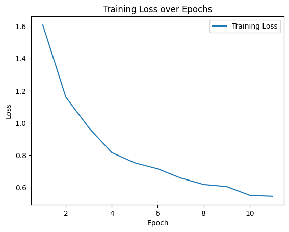
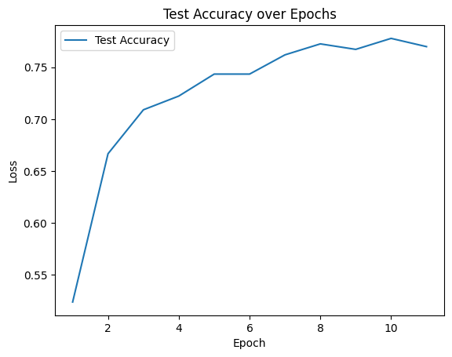
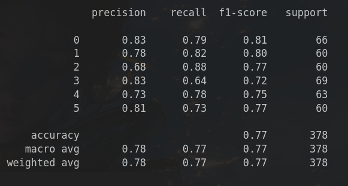

# Guitar Chord Recognition in Major C

## Supported Chords
- C
- Dm
- Em
- F
- G
- Am

## Training Process

### Data Preprocessing
- Extract chroma features from audio files.
- Resample the feature matrix to a fixed size of [224, 224].

### Model Architecture
- Utilize a pretrained ResNet model for feature extraction.
- Freeze the ResNet layers and train only the final classification layer.
- Train the model for 10 epochs initially, but can be adjusted.

### Performance Metrics



- recall & precision ...  
  

## Usage

```shell
git clone https://github.com/W1412X/Guitar-Chord-Audio-Recognition.git
cd Guitar-Chord-Audio-Recognition
cd example
python CChordRec.py
```

## Additional Features
- Augmentation techniques such as time stretching, pitch shifting, and noise addition are applied to the dataset to improve generalization.
- Future work may explore other feature extraction methods like MFCCs.

## Dependencies
Ensure you have installed all necessary libraries:
```shell
pip install librosa soundfile numpy torch torchvision tqdm scikit-learn matplotlib seaborn
```

## Contact
For any questions or contributions, please feel free to contact us through GitHub issues.